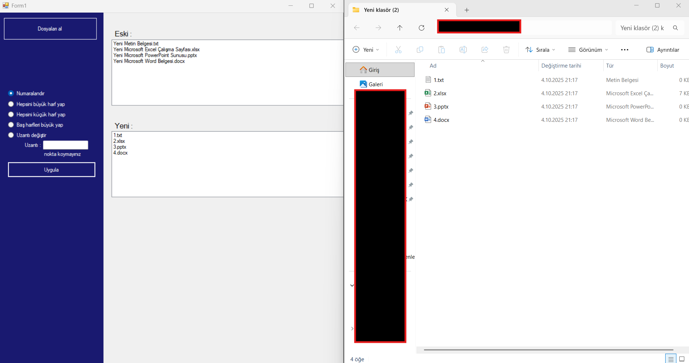
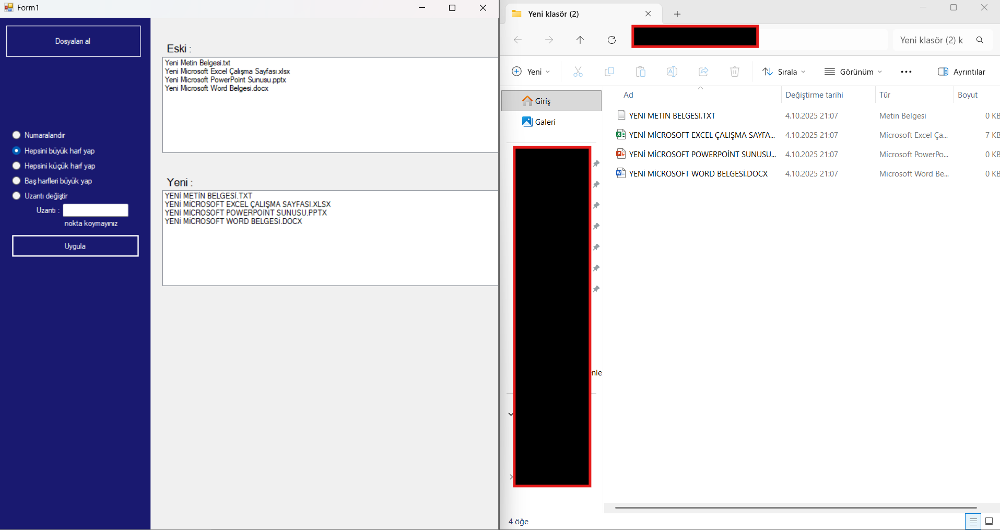
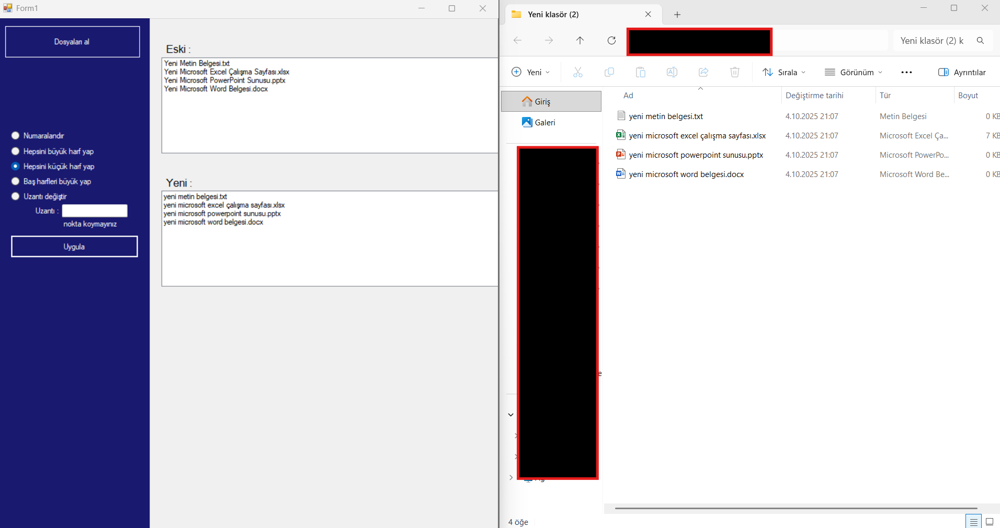
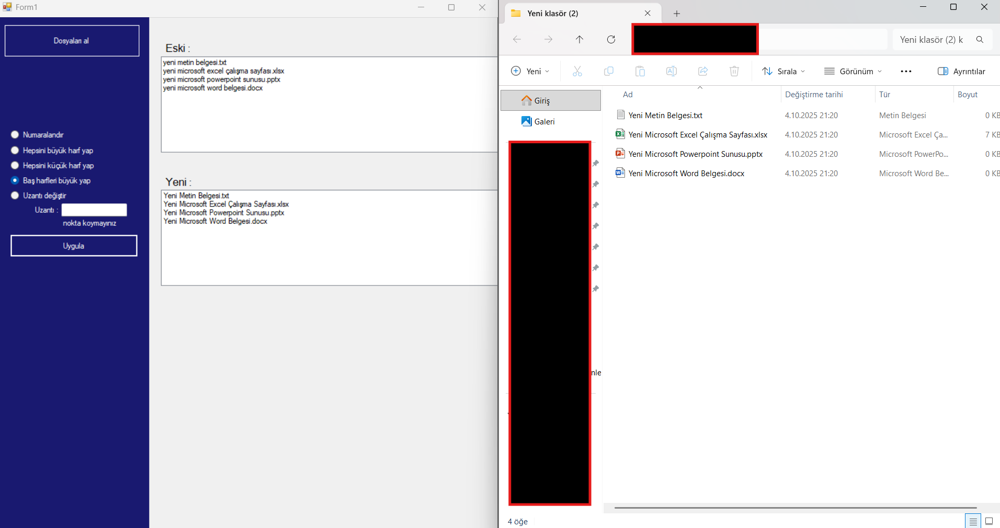
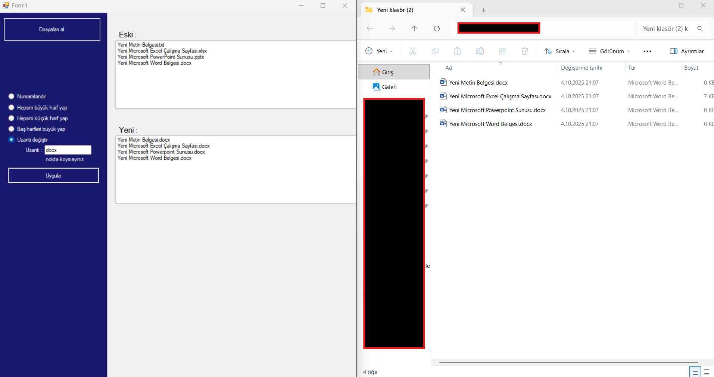

# 📂 Dosya İsim Düzenleyici (File Renamer)

C# ve Windows Forms kullanılarak geliştirilmiş, klasörlerdeki dosyaları toplu olarak yeniden adlandırmayı sağlayan pratik bir masaüstü aracıdır.

## 📋 Proje Hakkında

Bilgisayarınızdaki karmaşık dosya isimlerini tek tek değiştirmek yerine, belirlediğiniz kurallara göre saniyeler içinde düzenlemenize olanak tanır. Özellikle proje dosyalarını standartlaştırma işlemleri için idealdir.

### 🚀 Özellikler

* **Klasör Seçimi:** İşlem yapılacak dizinin kolayca seçilmesi.
* **Toplu İşlem:** Yüzlerce dosyayı aynı anda yeniden isimlendirme.
* **Uzantı Koruma:** İşlem sırasında dosya uzantılarının (.jpg, .txt vb.) bozulmasını engelleme.

## 🛠️ Teknolojiler

Bu proje aşağıdaki teknolojilerle geliştirilmiştir:

* **Dil:** C#
* **Platform:** Windows Forms (.NET Framework)
* **Kütüphane:** `System.IO` (Dosya ve Klasör işlemleri için)
* **IDE:** Visual Studio

## ⚠️ Önemli Uyarı

Bu program doğrudan dosya sisteminiz üzerinde değişiklik yapar.
* **Yedekleme:** Toplu işlem yapmadan önce dosyalarınızın yedeğini almanız önerilir.
* **Test:** İşlemi tüm klasöre uygulamadan önce, içinde 3-5 dosya olan bir test klasöründe deneme yapınız.

## 📷 Ekran Görüntüsü

